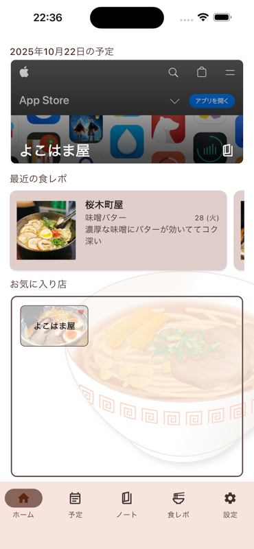
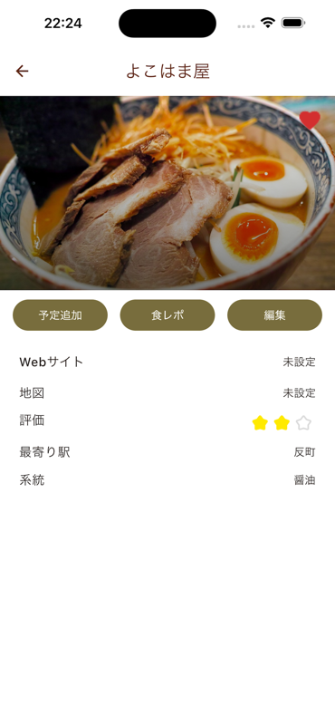
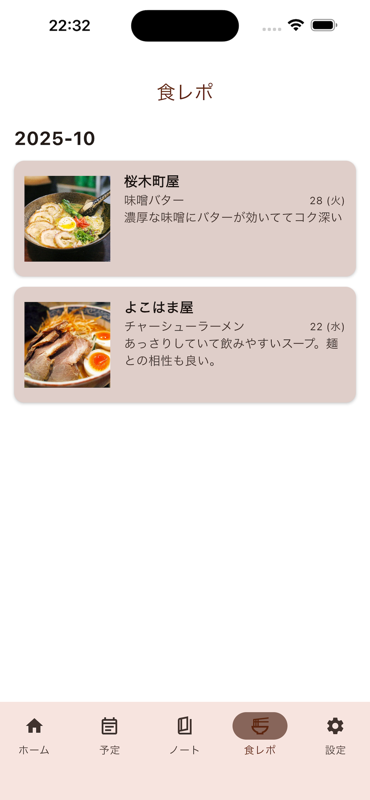
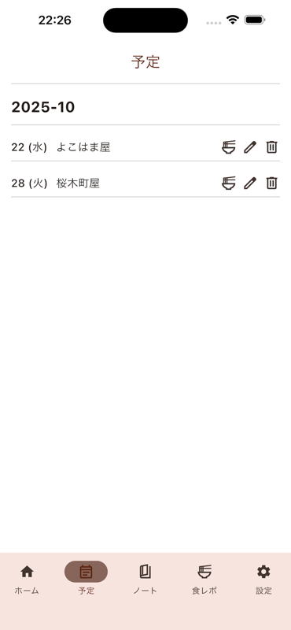

# RamenNote

ラーメン店の情報を記録・管理するための Kotlin Multiplatform アプリケーションです。

## 概要

RamenNote は、ラーメン店の情報をエリア別に管理し、訪問予定や食レポを記録できるアプリです。Android と iOS の両方のプラットフォームで動作します。

## スクリーンショット

<div align="center">
  
  
  
  
</div>

## 主な機能

- **ホーム画面**: 最近の食レポやお気に入り店を一覧表示
- **予定管理**: ラーメンを食べに行く予定を管理
- **ノート**: エリア別に店舗情報を登録・編集・管理
- **食レポ**: 訪問した店のレビューと写真を記録
- **設定**: アプリの各種設定

## 技術スタック

### フレームワーク・ライブラリ

- **Kotlin Multiplatform**: クロスプラットフォーム開発
- **Compose Multiplatform**: UI フレームワーク
- **Room**: ローカルデータベース
- **Koin**: 依存性注入
- **Ktor**: HTTP クライアント
- **Coil**: 画像読み込み
- **Navigation Compose**: 画面遷移

### 開発環境

- Kotlin: 2.2.10
- Compose Multiplatform: 1.9.0
- Android Gradle Plugin: 8.11.2
- Android SDK: minSdk 24, targetSdk 36, compileSdk 36

## プロジェクト構造

```
ramen-note/
├── composeApp/              # 共有コード
│   └── src/
│       ├── commonMain/      # 全プラットフォーム共通コード
│       ├── androidMain/     # Android 固有コード
│       └── iosMain/         # iOS 固有コード
├── iosApp/                  # iOS アプリケーション
└── gradle/                  # Gradle 設定
```

### 主要なパッケージ構成

- `data/`: データソース、リポジトリ、データベース
- `domain/`: ドメインモデル、ユースケース
- `ui/`: 画面、コンポーネント、ナビゲーション
- `di/`: 依存性注入の設定

## セットアップ

### 必要な環境

- JDK 11 以上
- Android Studio または IntelliJ IDEA
- Xcode (iOS ビルドの場合)

### Unsplash API の設定

エリアの画像を表示するために Unsplash API を使用しています。ビルド前に以下の手順で Access Key を設定してください。

1. [Unsplash Developers](https://unsplash.com/developers) でアプリケーションを登録し、Access Key を取得
2. `composeApp/src/commonMain/kotlin/dev/seabat/ramennote/config/UnsplashConfig.kt` を開く
3. `ACCESS_KEY` の値を取得した Access Key に置き換える

```kotlin
object UnsplashConfig {
    const val ACCESS_KEY = "YOUR_UNSPLASH_ACCESS_KEY"  // ここに実際の Access Key を設定
    // ...
}
```

**注意**: Access Key を設定せずにビルドすると、エリア画像の取得が正常に動作しません。

### ビルドと実行

#### Android アプリ

macOS/Linux:
```bash
./gradlew :composeApp:assembleDebug
```

Windows:
```bash
.\gradlew.bat :composeApp:assembleDebug
```

#### iOS アプリ

1. Xcode で `/iosApp` ディレクトリを開く
2. Xcode から実行するか、IDE の実行設定を使用

### コードスタイル (ktlint)

- チェック:  
  ```bash
  ./gradlew ktlintCheck
  ```
- フォーマット:  
  ```bash
  ./gradlew ktlintFormat
  ```

## ライセンス

このプロジェクトのライセンスについては [LICENSE](./LICENSE) ファイルを参照してください。

## 参考リンク

- [Kotlin Multiplatform 公式ドキュメント](https://www.jetbrains.com/help/kotlin-multiplatform-dev/get-started.html)
- [Compose Multiplatform](https://www.jetbrains.com/lp/compose-multiplatform/)
