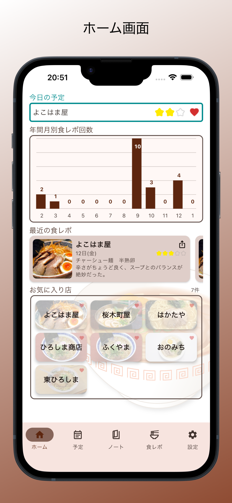
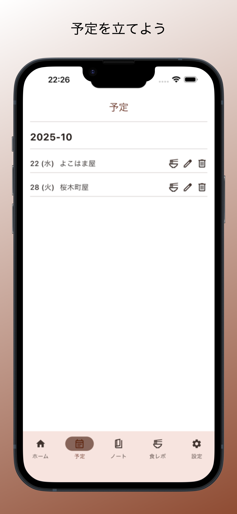
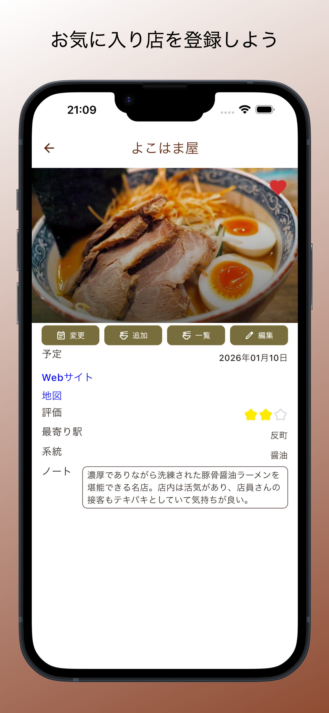
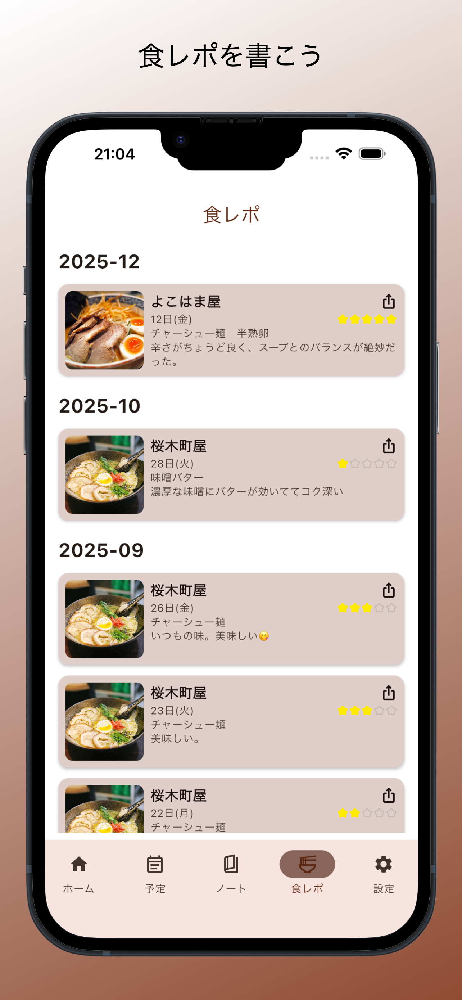

# RamenNote

ラーメン店の情報を記録・管理するための Kotlin Multiplatform アプリケーションです。

## 概要

RamenNote は、ラーメン店の情報をエリア別に管理し、訪問予定や食レポを記録できるアプリです。Android と iOS の両方のプラットフォームで動作します。

## スクリーンショット

<div align="center">
  
  
  
  
</div>

## ダウンロード

このアプリは以下のストアからダウンロードできます。

<div align="center">
  <a href="https://play.google.com/store/apps/details?id=jp.seabatlab.ramennote">
    
  </a>
  <a href="https://apps.apple.com/jp/app/%E3%83%A9%E3%83%BC%E3%83%A1%E3%83%B3note/id6754216932">
    
  </a>
</div>

## 主な機能

- **ホーム画面**: 最近の食レポやお気に入り店を一覧表示
- **予定管理**: ラーメンを食べに行く予定を管理
- **ノート**: エリア別に店舗情報を登録・編集・管理
- **食レポ**: 訪問した店のレビューと写真を記録
- **設定**: アプリの各種設定

## 技術スタック

### フレームワーク・ライブラリ

- **Kotlin Multiplatform**: クロスプラットフォーム開発
- **Compose Multiplatform**: UI フレームワーク
- **Room**: ローカルデータベース
- **Koin**: 依存性注入
- **Ktor**: HTTP クライアント
- **Coil**: 画像読み込み
- **Navigation Compose**: 画面遷移
- **SKIE**: Kotlin/Swift 連携（iOS）
- **compose-nav-graph**: IDE の NavGraph Graph ビュー（ナビゲーション構造の可視化）
- **Firebase**: Analytics・Crashlytics・AI・App Check（Android: Play Integrity / Debug、iOS: DeviceCheck / Debug）
- **Gemini AI**: AI 機能（Android）

### 開発環境

- Kotlin: 2.3.21
- Compose Multiplatform: 1.12.0
- Android Gradle Plugin: 9.3.2
- Gradle: 9.7.1（AGP 9.3 以降は Gradle 9.5 以上が必須）
- Android SDK: minSdk 24, targetSdk 37, compileSdk 37

## プロジェクト構造

```
ramen-note/
├── sharedLogic/             # KMP ライブラリ: data / domain / config 層
│   └── src/
│       ├── commonMain/      # 共通コード（Room・Repository・UseCase・API クライアント）
│       ├── androidMain/     # Android 固有実装
│       └── iosMain/         # iOS 固有実装
├── sharedUI/                # Compose Multiplatform ライブラリ: ui / di 層（commonMain 中心）
├── androidApp/              # Android アプリのエントリーポイント
├── iosApp/                  # iOS アプリ（Swift / Xcode）
└── gradle/                  # バージョンカタログ（libs.versions.toml）
```

### 主要なパッケージ構成

- `sharedLogic` の `data/`: データソース、リポジトリ、Room データベース
- `sharedLogic` の `domain/`: ドメインモデル、ユースケース
- `sharedUI` の `ui/`: 画面、コンポーネント、ナビゲーション
- `sharedUI` / `sharedLogic` の `di/`: 依存性注入（Koin）の設定

## セットアップ

### 必要な環境

- JDK 11 以上
- Android Studio または IntelliJ IDEA
- Xcode (iOS ビルドの場合)

### Unsplash API の設定

エリアの画像を表示するために Unsplash API を使用しています。ビルド前に以下の手順で Access Key を設定してください。

1. [Unsplash Developers](https://unsplash.com/developers) でアプリケーションを登録し、Access Key を取得
2. プロジェクトルートの `local.properties` に以下を追加

```properties
UNSPLASH_ACCESS_KEY=取得した Access Key
```

ビルド時に Gradle が `local.properties` から値を読み込み、commonMain 向けに `BuildSecrets.kt` を自動生成します。アプリコードは `BuildSecrets.UNSPLASH_ACCESS_KEY` 経由で参照します。

**注意**: Access Key を設定せずにビルドすると、エリア画像の取得が正常に動作しません。

### Firebase App Check の設定

Firebase App Check によって不正クライアントからの API アクセスを防いでいます。詳細は [`docs/firebase-api-security.md`](./docs/firebase-api-security.md) を参照してください。

| プラットフォーム | 本番ビルド | デバッグビルド |
|----------------|-----------|--------------|
| Android | Play Integrity | Debug プロバイダー |
| iOS | DeviceCheck | Debug プロバイダー |

### Firebase AI Logic（Gemini）の設定

店舗情報の自動生成（店を追加する際に、エリア名と店名から Web サイト・最寄り駅・カテゴリ・
紹介文を AI が生成）に **Firebase AI Logic** を利用しています。

| 項目 | 内容 |
|------|------|
| バックエンド | Vertex AI / Agent Platform（`GenerativeBackend.agentPlatform(location = "global")`） |
| モデル | `gemini-3.1-flash-lite` |
| 課金 | Vertex AI（`aiplatform.googleapis.com`）の従量課金。Agent Platform の利用分を含む |
| 請求先 | Firebase（Blaze プラン）に紐づく Cloud Billing アカウント。プロジェクト × サービス単位で利用額上限を設定済み |
| 実装 | `sharedLogic` の `ShopAiDataSource`（androidMain）/ `FetchAiShopInfoUseCase` |

コスト削減のため、以下を実施しています（詳細は下記ドキュメント参照）。

- **思考トークンの無効化**（`thinkingBudget = 0`）… 単純な抽出・分類タスクのため
- **出力トークン上限**（`maxOutputTokens = 512`）
- **Room キャッシュ**（`shop_ai_cache` テーブル）… 同一 (エリア, 店名) は再生成時に API を叩かない

**前提**: App Check が有効（ENFORCED）のため、デバッグビルドを実機/エミュで動かす場合は、
起動時に logcat へ出力されるデバッグトークンを Firebase コンソール（App Check → デバッグトークン）に
登録する必要があります。

> ℹ️ `GenerativeBackend.vertexAI()` は firebase-ai 17.16.0（firebase-bom 34.18.0）で deprecated と
> なったため、後継の `agentPlatform()` に移行しました。リクエスト先のホスト・パスは従来と同一で、
> Firebase / Google Cloud のコンソール設定（AI Logic・App Check・利用額上限）の変更は不要です。
> 詳細は [`docs/firebase-ai-backend-migration.md`](./docs/firebase-ai-backend-migration.md) を参照。

> 💡 料金体系・コスト管理の方針・実施記録は [`docs/vertex-ai-cost-management.md`](./docs/vertex-ai-cost-management.md)、
> バックエンド API の移行記録は [`docs/firebase-ai-backend-migration.md`](./docs/firebase-ai-backend-migration.md) を参照してください。
> AI 実装のコーディングルールは [`.claude/rules/ai-implementation.md`](./.claude/rules/ai-implementation.md) にまとめています。

### ビルドと実行

#### Android アプリ

macOS/Linux:
```bash
./gradlew :androidApp:assembleDebug
```

Windows:
```bash
.\gradlew.bat :androidApp:assembleDebug
```

#### iOS アプリ

1. Xcode で `/iosApp` ディレクトリを開く
2. Xcode から実行するか、IDE の実行設定を使用

### コードスタイル (ktlint)

- チェック:  
  ```bash
  ./gradlew ktlintCheck
  ```
- フォーマット:  
  ```bash
  ./gradlew ktlintFormat
  ```

### NavGraph Graph ビュー

compose-nav-graph プラグイン（0.2.1）を導入しており、IDE の **NavGraph Graph** タブでナビゲーション構造を視覚的に確認できます。

プレビューギャラリーの生成:
```bash
./gradlew :sharedUI:generatePreviewGallery
```

> **注意**: `@Preview` アノテーションは `androidx.compose.ui.tooling.preview.Preview` を使用してください。`org.jetbrains` 版は Compose Multiplatform 1.9.0 で deprecated となり、compose-nav-graph の KSP プロセッサが認識しません。

## Claude Code

このプロジェクトは [Claude Code](https://claude.ai/code) による AI 支援開発に対応しています。

### プロジェクト設定（CLAUDE.md）

`.claude/CLAUDE.md` にアーキテクチャ・コーディング規約・DI 登録ルール・PR フォーマットなどのプロジェクト固有の指示を記載しています。Claude Code はこのファイルを自動的に読み込み、プロジェクトのルールに従った提案・実装を行います。

### スキル（Skills）

Claude Code のカスタムスキルを `.claude/skills/` に定義しています。

| スキル                       | 説明                                                                                                                                         |
|-----------------------------|----------------------------------------------------------------------------------------------------------------------------------------------|
| `/android-device-interactor`| Android 実機・エミュレータを操作して動作確認を行う。UI 要素のレイアウト取得・座標特定、タップ・テキスト入力・スワイプ・キーイベント送出を Android CLI と adb 経由で実行する |
| `/icon-replacer`            | Android・iOS 両プラットフォームのアプリアイコン・スプラッシュスクリーン・タスクスイッチャーオーバーレイを一括で差し替える。開発者が `content_image`・`transparent_image`・`bg_color` を用意し、明示的に実行する |
| `/pr-create`                | 現在のブランチから PR を日本語で作成。ベースブランチを自動検出してユーザーに確認後、所定のフォーマットで `gh pr create` を実行する            |
| `/release-prep`             | リリース前の準備作業。現在ブランチと main のバージョン比較・確認 → 前回リリース差分の把握 → ストア向けリリースノートの作成・保存             |

### サブエージェント（Agents）

`.claude/agents/` にカスタムサブエージェントを定義しています。

| エージェント          | 説明                                                                                                                                                                    |
|---------------------|-------------------------------------------------------------------------------------------------------------------------------------------------------------------------|
| `ui-ux-designer`    | Compose Multiplatform 画面の UI/UX レビュー・改善提案・実装を行う専門エージェント。Material Design 3 準拠・アクセシビリティ・ユーザビリティの観点で分析し、`.claude/agent-memory/ui-ux-designer/` に知識を蓄積する。`*Screen.kt`（`sharedUI/src/commonMain/kotlin/dev/seabat/ramennote/ui/screens/` 配下）を作成・大きく変更したとき、または UI/UX レビュー依頼時に自動的に起動を促す |
| `regression-reviewer` | 過去に発生したデグレの再発防止チェックリストに基づきコード変更を静的レビューするエージェント。`HistoryScreen.kt` や LazyColumn 構造を変更した際に自動的に起動を促す。確認済みデグレパターンは `.claude/agent-memory/regression-reviewer/` に蓄積する |
| `readme-updater`      | `README.md` をプロジェクトの実態と常に同期させるエージェント。スキル・エージェント・Hooks・技術スタックの変更時に該当セクションを更新する。更新パターンは `.claude/agent-memory/readme-updater/` に蓄積する |

#### regression-reviewer のチェック項目

| チェック ID | 対象機能 | 主な確認内容 |
|------------|---------|------------|
| CHECK-1 | HistoryScreen 自動スクロール | `LaunchedEffect` のキーが `reportId` のみか／全件待機ループの有無／LazyColumn の item オフセット値／インデックス増分順序（increment-then-check）／`clearReportIdParam()` の呼び出しタイミング |

> **チェック項目の追加方法**: `.claude/agents/regression-reviewer.md` に `CHECK-N` セクションを追記する。新たなデグレが発生した際は根本原因・検出方法・修正方針を記録し、次回以降の自動チェックに組み込む。

### Hooks

`.claude/settings.json` に以下の自動処理を設定しています。

| タイミング                | 処理                                                                                          |
|--------------------------|-----------------------------------------------------------------------------------------------|
| `Edit` / `Write` 前      | `local.properties`・`google-services.json`・`.env` への変更をブロック |
| `Bash` 前（危険コマンド）| `push --force`・`reset --hard`・`clean -fd`・`rm -rf /` をブロック                           |
| `Bash` 前（コミット）    | `git commit` 前に `ktlintFormat` を自動実行し、フォーマット済みファイルをステージング        |
| `Edit` / `Write` 後      | 変更ファイルに応じてサブエージェント起動を促すリマインダを表示（`.claude/` 配下 または `build.gradle.kts` → readme-updater／`*Screen.kt` → ui-ux-designer／`LazyColumn` を含む `*Screen.kt` → regression-reviewer も） |
| 応答完了時（Stop）       | macOS 通知で「応答が必要です」を表示                                                          |

## ライセンス

このプロジェクトのライセンスについては [LICENSE](./LICENSE) ファイルを参照してください。

## 参考リンク

- [Kotlin Multiplatform 公式ドキュメント](https://www.jetbrains.com/help/kotlin-multiplatform-dev/get-started.html)
- [Compose Multiplatform](https://www.jetbrains.com/lp/compose-multiplatform/)
